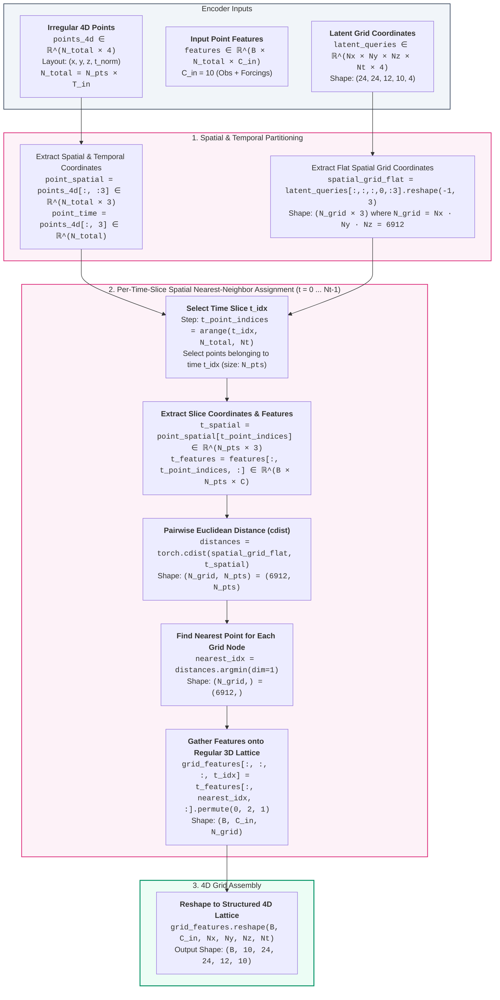
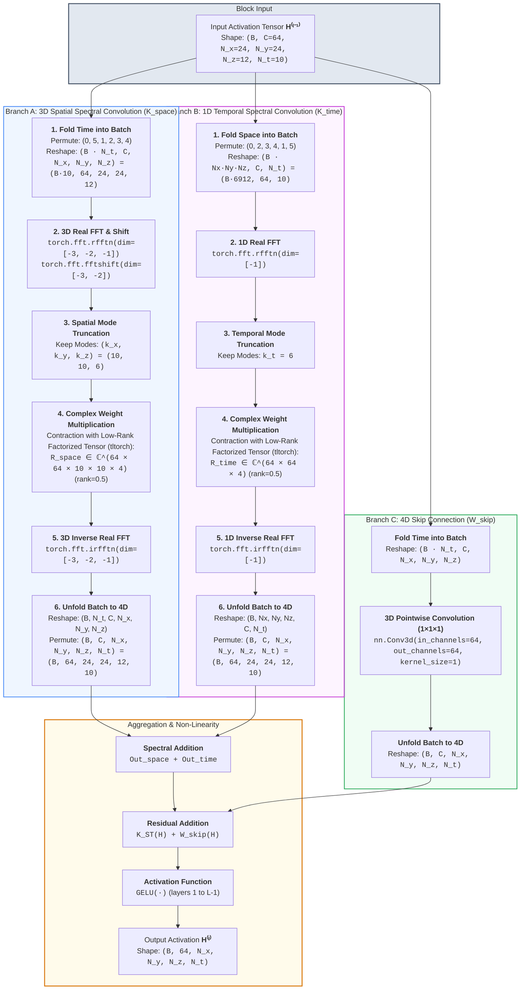
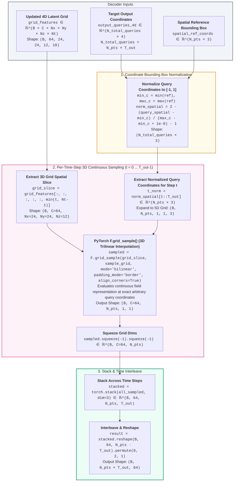

# Space-Time Factorized Fourier Neural Operator (ST-FNO) Architecture

This document provides a comprehensive technical reference and architecture diagrams for the **Space-Time Factorized Fourier Neural Operator** (`FNOInterpolate`), derived directly from the training pipeline and model implementation in this repository.

---

## Table of Contents
1. [End-to-End Architecture Overview](#1-end-to-end-architecture-overview)
2. [Interpolation Encoding: Irregular Point Cloud → 4D Latent Grid](#2-interpolation-encoding-irregular-point-cloud--4d-latent-grid)
3. [Space-Time Factorized Spectral Conv Block](#3-space-time-factorized-spectral-conv-block)
4. [Interpolation Decoding: 4D Latent Grid → Continuous Physical Queries](#4-interpolation-decoding-4d-latent-grid--continuous-physical-queries)
5. [Data Flow & Collation Pipeline](#5-data-flow--collation-pipeline)
6. [Detailed Layer Specifications & Tensor Shapes](#6-detailed-layer-specifications--tensor-shapes)
7. [Mathematical Formulation](#7-mathematical-formulation)
8. [Domain Decomposition & Loss Computation](#8-domain-decomposition--loss-computation)
9. [Code References](#9-code-references)

---

## 1. End-to-End Architecture Overview

The `FNOInterpolate` model bridges irregular unstructured meshes (FEFLOW point clouds) and regular grid-based spectral Fourier Neural Operators via a 3-stage process: **Encode (Interpolate) $\to$ Process (Factorized Space-Time FNO) $\to$ Decode (Continuous `grid_sample`)**.

```mermaid
flowchart TD
    subgraph STAGE1 ["Stage 1: Input & 4D Interpolation Encoding"]
        direction TB
        input_data["<b>Input Point Cloud & Time</b><br/>Points: <code>N_pts = N_core + N_ghost</code><br/>Horizon: <code>T_in = 10</code><br/>Coords: <code>(x, y, z, t_norm) ∈ ℝ^(N_pts·T_in × 4)</code><br/>Features: <code>X ∈ ℝ^(B × N_pts·T_in × 10)</code>"]
        grid_mesh["<b>4D Latent Regular Grid</b><br/>Spatial: <code>(Nx, Ny, Nz) = (24, 24, 12)</code><br/>Temporal: <code>Nt = 10</code><br/>Meshgrid: <code>ℝ^(Nx × Ny × Nz × Nt × 4)</code>"]
        
        encode_op["<b>_interpolate_to_grid()</b><br/>For each time slice t ∈ [0, Nt-1]:<br/>• Spatial <code>cdist()</code> Euclidean distance<br/>• Nearest-neighbor assignment <code>argmin(dim=1)</code>"]
        
        input_data & grid_mesh --> encode_op
        encode_op --> grid_feat["<b>Gridded 4D Tensor</b><br/>Shape: <code>(B, C_in=10, Nx, Ny, Nz, Nt)</code>"]
    end

    subgraph STAGE2 ["Stage 2: Lifting & Factorized FNO Backbone"]
        direction TB
        grid_feat --> lift_mlp["<b>Lifting MLP (2 Layers)</b><br/><code>C_in (10) → d_lift (64) → d_hidden (64)</code><br/>Activation: GELU"]
        lift_mlp --> h0["<b>Latent Grid Activation H⁽⁰⁾</b><br/>Shape: <code>(B, 64, Nx=24, Ny=24, Nz=12, Nt=10)</code>"]
        
        h0 --> fno_block1["<b>FNO Block 1</b><br/>Factorized Space-Time Conv + Conv3d Skip + GELU"]
        fno_block1 --> fno_block2["<b>FNO Block 2</b><br/>Factorized Space-Time Conv + Conv3d Skip + GELU"]
        fno_block2 --> fno_block3["<b>FNO Block 3</b><br/>Factorized Space-Time Conv + Conv3d Skip + GELU"]
        fno_block3 --> fno_block4["<b>FNO Block 4</b><br/>Factorized Space-Time Conv + Conv3d Skip (Linear)"]
        
        fno_block4 --> h_latent["<b>Updated 4D Latent Grid H⁽⁴⁾</b><br/>Shape: <code>(B, 64, Nx=24, Ny=24, Nz=12, Nt=10)</code>"]
    end

    subgraph STAGE3 ["Stage 3: 4D Continuous Decoding & Projection"]
        direction TB
        out_coords["<b>Output Query Coordinates</b><br/>Target physical locations across future time<br/>Shape: <code>(N_pts × T_out, 4)</code>"]
        
        decode_op["<b>_interpolate_from_grid()</b><br/>For each time slice t ∈ [0, T_out-1]:<br/>• Normalize query coords to [-1, 1]<br/>• 3D Trilinear <code>F.grid_sample()</code><br/>• Stack & interleave across time"]
        
        h_latent & out_coords --> decode_op
        decode_op --> h_pts["<b>Continuous Sampled Field</b><br/>Shape: <code>(B, N_pts × T_out, 64)</code>"]
        
        h_pts --> proj_mlp["<b>Projection MLP (2 Layers)</b><br/><code>d_hidden (64) → 2×d_hidden (128) → C_out (2)</code><br/>Variables: mass_concentration, head"]
        proj_mlp --> raw_preds["<b>Raw Predictions Ŷ</b><br/>Shape: <code>(B, N_pts × T_out, 2)</code>"]
    end

    subgraph STAGE4 ["Stage 4: Domain Decomposition & Multi-Column Loss"]
        direction TB
        raw_preds --> reshape_op["<b>Reshape to 4D Tensor</b><br/><code>(B, N_pts, T_out, C_out)</code>"]
        reshape_op --> core_slice["<b>Core Node Extraction</b><br/>Slice interior domain: <code>Ŷ[:, :N_core, :, :]</code><br/>(Exclude buffer ghost nodes from loss)"]
        core_slice --> loss_fn["<b>variance_aware_multicol_loss</b><br/>• Linear Pushforward Temporal Weights: <code>w_t ∈ [1.0, 2.0]</code><br/>• Global Relative L2 Loss across (N, C)<br/>• Variance-Aware Concentration Loss<br/><code>ℒ = (1 - λ)ℒ_global + λℒ_conc_var</code>"]
    end

    STAGE1 --> STAGE2 --> STAGE3 --> STAGE4

    classDef stageStyle fill:#f8fafc,stroke:#334155,stroke-width:2px;
    classDef blockStyle fill:#eff6ff,stroke:#2563eb,stroke-width:1.5px;
    classDef tensorStyle fill:#fef3c7,stroke:#d97706,stroke-width:1.5px;
    classDef interpStyle fill:#fdf2f8,stroke:#db2777,stroke-width:2px;

    class STAGE1,STAGE2,STAGE3,STAGE4 stageStyle;
    class lift_mlp,fno_block1,fno_block2,fno_block3,fno_block4,proj_mlp,loss_fn blockStyle;
    class grid_feat,h0,h_latent,h_pts,raw_preds tensorStyle;
    class encode_op,decode_op interpStyle;
```

---

## 2. Interpolation Encoding: Irregular Point Cloud → 4D Latent Grid

The encoder [`_interpolate_to_grid`](file:///Users/arpitkapoor/Projects/groundwater/GW_SciML/src/models/neuralop/fno.py#L522-L602) maps irregular 3D point cloud nodes across time steps into a structured 4D regular tensor lattice $(N_x, N_y, N_z, N_t)$:

---

## 3. Space-Time Factorized Spectral Conv Block

Inside each [`FNOBlocks`](file:///Users/arpitkapoor/Projects/groundwater/GW_SciML/src/models/neuralop/fno.py#L91-L210) layer, full 4D Fourier convolution is split into decoupled spatial and temporal spectral convolutions:

---

## 4. Interpolation Decoding: 4D Latent Grid → Continuous Physical Queries

The decoder [`_interpolate_from_grid`](file:///Users/arpitkapoor/Projects/groundwater/GW_SciML/src/models/neuralop/fno.py#L604-L669) decodes the updated regular grid back to continuous physical point coordinates $(x_q, y_q, z_q)$ across prediction horizon $T_{\text{out}}$ using continuous **3D Trilinear `grid_sample`**:

---

## 5. Data Flow & Collation Pipeline

In [`src/data/data_utils.py:make_collate_fn`](file:///Users/arpitkapoor/Projects/groundwater/GW_SciML/src/data/data_utils.py#L185):

1. **Spatial Point Assembly**:
   - Each patch contains $N_{\text{core}}$ internal nodes and $N_{\text{ghost}}$ boundary buffer nodes:
     $$N_{\text{pts}} = N_{\text{core}} + N_{\text{ghost}}$$
2. **Time Window Setup**:
   - Input horizon: $T_{\text{in}} = 10$ timesteps.
   - Output horizon: $T_{\text{out}} = 10$ timesteps.
   - Times are normalized: $t_{\text{norm}} = \frac{t - \mu_t}{\sigma_t}$.
3. **4D Coordinate Tensors**:
   - Input coordinates $\mathbf{X}_{\text{coord}} \in \mathbb{R}^{(N_{\text{pts}} \cdot T_{\text{in}}) \times 4}$ where each row is $(x, y, z, t_{\text{norm}})$.
   - Output coordinates $\mathbf{Y}_{\text{coord}} \in \mathbb{R}^{(N_{\text{pts}} \cdot T_{\text{out}}) \times 4}$.
4. **Input Feature Packing ($C_{\text{in}} = 10$)**:
   $$\mathbf{X} = \big[ \mathbf{X}_{\text{obs}}^{(t_{\text{in}})} \;(2) \;\parallel\; \mathbf{F}_{\text{curr}}^{(t_{\text{in}})} \;(4) \;\parallel\; \mathbf{F}_{\text{future}}^{(t_{\text{out}})} \;(4) \big]$$

---

## 6. Detailed Layer Specifications & Tensor Shapes

| Stage | Operation / Module | Input Shape | Output Shape | Parameters & Hyperparameters |
| :--- | :--- | :--- | :--- | :--- |
| **Input Assembly** | `collate_fn` | Raw nodes & times | $\mathbf{X}: (B, N_{\text{pts}} \cdot T_{\text{in}}, 10)$ | $C_{\text{in}} = 10, T_{\text{in}} = 10, T_{\text{out}} = 10$ |
| **Grid Encoding** | `_interpolate_to_grid` | $(B, N_{\text{pts}} \cdot T_{\text{in}}, 10)$ | $(B, 10, 24, 24, 12, 10)$ | Nearest-neighbor spatial `cdist` per time slice |
| **Lifting MLP** | `FNOInterpolate.lifting` | $(B, 10, 24, 24, 12, 10)$ | $(B, 64, 24, 24, 12, 10)$ | 2-layer MLP ($10 \to 64 \to 64$), GELU |
| **Spatial Conv (×4)** | `SpatialConv (3D)` | $(B \cdot 10, 64, 24, 24, 12)$ | $(B \cdot 10, 64, 24, 24, 12)$ | 3D RFFT, modes $(10, 10, 6)$, tltorch rank=0.5 |
| **Temporal Conv (×4)**| `TemporalConv (1D)` | $(B \cdot 6912, 64, 10)$ | $(B \cdot 6912, 64, 10)$ | 1D RFFT, modes $k_t = 6$, tltorch rank=0.5 |
| **Skip Conv (×4)** | `FNOBlocks.fno_skips` | $(B \cdot 10, 64, 24, 24, 12)$ | $(B \cdot 10, 64, 24, 24, 12)$ | `nn.Conv3d(64, 64, kernel_size=1, bias=False)` |
| **Grid Decoding** | `_interpolate_from_grid` | $(B, 64, 24, 24, 12, 10)$ | $(B, N_{\text{pts}} \cdot T_{\text{out}}, 64)$ | 3D continuous `F.grid_sample` (trilinear) |
| **Projection MLP** | `FNOInterpolate.projection` | $(B, 64, N_{\text{pts}} \cdot T_{\text{out}})$ | $(B, N_{\text{pts}} \cdot T_{\text{out}}, 2)$ | 2-layer MLP ($64 \to 128 \to 2$) for (conc, head) |
| **Core Extraction** | `_fno_4d_extract_core` | $(B, N_{\text{pts}} \cdot T_{\text{out}}, 2)$ | $(B, N_{\text{core}}, T_{\text{out}}, 2)$ | Slices first $N_{\text{core}}$ points along spatial dim |
| **Loss** | `variance_aware_multicol_loss` | $(B, N_{\text{core}}, T_{\text{out}}, 2)$ | Scalar Loss $\mathcal{L}$ | Relative $L_2$ + temporal pushforward $w_t \in [1, 2]$ |

---

## 7. Mathematical Formulation

### 7.1. Continuous Factorized Integral Kernel
Let $v(x, y, z, t) \in \mathbb{R}^{d_{\text{hidden}}}$ represent the latent space-time feature field. The action of layer $l$ is defined as:

$$v^{(l+1)}(\mathbf{x}, t) = \sigma \left( \mathcal{K}_{\text{ST}}(v^{(l)})(\mathbf{x}, t) + W_{\text{skip}} v^{(l)}(\mathbf{x}, t) \right)$$

where the factorized kernel operator is:

$$\mathcal{K}_{\text{ST}}(v) = \mathcal{K}_{\text{space}}(v) + \mathcal{K}_{\text{time}}(v)$$

### 7.2. Spatial Spectral Kernel
For each temporal slice $t$:
$$\mathcal{K}_{\text{space}}(v)(\mathbf{x}, t) = \mathcal{F}_{\text{3D}}^{-1} \left( R_{\text{space}} \cdot \mathcal{F}_{\text{3D}}(v(\cdot, t)) \right)(\mathbf{x})$$
- $\mathcal{F}_{\text{3D}}$ is the 3D real Fourier transform over $(X, Y, Z)$.
- Modes are truncated to $k_x \le 10, k_y \le 10, k_z \le 6$.
- $R_{\text{space}}$ is a complex parameter tensor represented in low-rank factorized format via TensorLy-Torch (`tltorch`).

### 7.3. Temporal Spectral Kernel
For each spatial location $\mathbf{x} = (x, y, z)$:
$$\mathcal{K}_{\text{time}}(v)(\mathbf{x}, t) = \mathcal{F}_{\text{1D}}^{-1} \left( R_{\text{time}} \cdot \mathcal{F}_{\text{1D}}(v(\mathbf{x}, \cdot)) \right)(t)$$
- $\mathcal{F}_{\text{1D}}$ is the 1D real Fourier transform over $T$.
- Modes are truncated to $k_t \le 6$.

---

## 8. Domain Decomposition & Loss Computation

### 8.1. Core vs. Ghost Node Handling
To prevent artificial boundary artifacts from polluting the loss during patch-based domain decomposition, the model evaluates on the full patch ($N_{\text{core}} + N_{\text{ghost}}$) to ensure smooth interpolation, but the loss is computed **strictly on core nodes**:
$$\hat{\mathbf{Y}}_{\text{core}} = \hat{\mathbf{Y}}[:, :N_{\text{core}}, :, :]$$

### 8.2. Pushforward Temporal Weighting
To mitigate error accumulation over long rollout horizons, timesteps are linearly weighted from $1.0$ to $2.0$:
$$w_t = 1.0 + \frac{t - 1}{T_{\text{out}} - 1}, \quad t \in \{1, \dots, T_{\text{out}}\}$$

### 8.3. Total Multi-Column Objective
$$\mathcal{L}_{\text{total}} = (1 - \lambda) \mathcal{L}_{\text{global}} + \lambda \mathcal{L}_{\text{conc-var}}$$

1. **Global Relative $L_2$ Loss**:
   $$\mathcal{L}_{\text{global}} = \frac{\sum_{t=1}^{T_{\text{out}}} w_t \cdot \frac{\|\hat{\mathbf{Y}}_t - \mathbf{Y}_t\|_2}{\|\mathbf{Y}_t\|_2 + \epsilon}}{\sum_{t=1}^{T_{\text{out}}} w_t}$$
2. **Variance-Aware Concentration Loss**:
   $$\mathcal{L}_{\text{conc-var}} = \frac{\sum_{t=1}^{T_{\text{out}}} w_t \cdot \frac{\|(\hat{\mathbf{C}}_t - \mathbf{C}_t) \odot \sqrt{\mathbf{w}_{\text{spatial}}}\|_2}{\|\mathbf{C}_t \odot \sqrt{\mathbf{w}_{\text{spatial}}}\|_2 + \epsilon}}{\sum_{t=1}^{T_{\text{out}}} w_t}$$
   where $\mathbf{w}_{\text{spatial}}$ are pre-computed normalized temporal variances emphasizing high-gradient dynamic plume fronts.

---

## 9. Code References

- **Training Entrypoint**: [`fno_train.py`](file:///Users/arpitkapoor/Projects/groundwater/GW_SciML/fno_train.py)
- **Model Definition (`FNOInterpolate`)**: [`src/models/neuralop/fno.py:362`](file:///Users/arpitkapoor/Projects/groundwater/GW_SciML/src/models/neuralop/fno.py#L362)
- **Factorized Space-Time Conv**: [`src/models/neuralop/fno.py:15`](file:///Users/arpitkapoor/Projects/groundwater/GW_SciML/src/models/neuralop/fno.py#L15)
- **Spectral Convolution**: [`src/models/neuralop/conv.py:43`](file:///Users/arpitkapoor/Projects/groundwater/GW_SciML/src/models/neuralop/conv.py#L43)
- **Collate Function & 4D Batching**: [`src/data/data_utils.py:185`](file:///Users/arpitkapoor/Projects/groundwater/GW_SciML/src/data/data_utils.py#L185)
- **Variance-Aware Multi-Column Loss**: [`src/models/neuralop/losses.py:607`](file:///Users/arpitkapoor/Projects/groundwater/GW_SciML/src/models/neuralop/losses.py#L607)
- **Execution Script**: [`hpc/configs/fno/forcing_4d.sh`](file:///Users/arpitkapoor/Projects/groundwater/GW_SciML/hpc/configs/fno/forcing_4d.sh)
