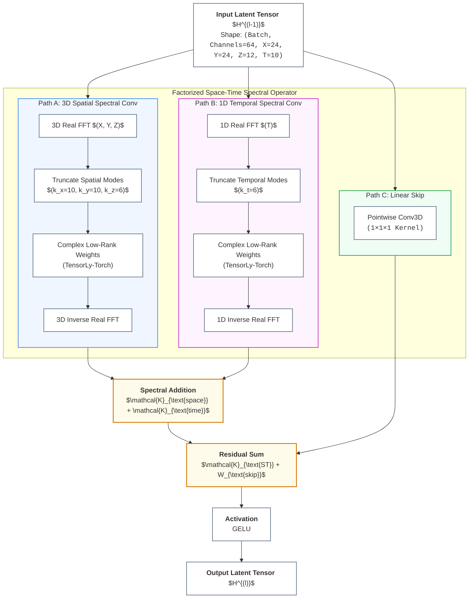

# Space-Time Factorized FNO: Presentation Overview

A clean, presentation-ready overview of the **Space-Time Factorized Fourier Neural Operator** (`FNOInterpolate`). This document summarizes the end-to-end forecasting pipeline and core operator mechanics into two high-level, easily digestible diagrams suitable for meetings and slide decks.

---

## 1. End-to-End Prediction Pipeline

The model transforms unstructured mesh inputs into continuous space-time forecasts through a three-stage **Encode $\to$ Process $\to$ Decode** pipeline.

```mermaid
flowchart LR
    subgraph INPUT ["1. Irregular Mesh Input"]
        direction TB
        in_pts["<b>Unstructured 3D Point Cloud</b><br/>• History: $T_{\text{in}} = 10$ steps<br/>• Features: Concentrations, Heads, Pumping"]
    end

    subgraph ENCODE ["2. Grid Encoding"]
        direction TB
        enc["<b>Nearest-Neighbor Mapping</b><br/>Projects irregular nodes onto<br/>regular 4D Latent Grid<br/><code>(24 × 24 × 12 × 10)</code>"]
    end

    subgraph BACKBONE ["3. Space-Time FNO"]
        direction TB
        fno["<b>Factorized Spectral Backbone</b><br/>• 2-Layer Lifting MLP<br/>• 4× Space-Time Conv Blocks<br/>• Decoupled 3D Space + 1D Time"]
    end

    subgraph DECODE ["4. Continuous Decoding"]
        direction TB
        dec["<b>3D Trilinear Sampling</b><br/><code>F.grid_sample()</code> decodes<br/>latent grid back to arbitrary<br/>query coordinates"]
    end

    subgraph OUTPUT ["5. Output & Loss"]
        direction TB
        out["<b>Forecast & Training Loss</b><br/>• Future Horizon: $T_{\text{out}} = 10$<br/>• Projection MLP (Conc, Head)<br/>• Variance-Aware Core Loss"]
    end

    INPUT --> ENCODE --> BACKBONE --> DECODE --> OUTPUT

    classDef default fill:#ffffff,stroke:#64748b,stroke-width:1.5px;
    classDef highlight fill:#eff6ff,stroke:#2563eb,stroke-width:2px;
    classDef accent fill:#fdf4ff,stroke:#c026d3,stroke-width:2px;
    classDef success fill:#ecfdf5,stroke:#059669,stroke-width:2px;

    class INPUT default;
    class ENCODE,DECODE highlight;
    class BACKBONE accent;
    class OUTPUT success;
```

### Key Takeaways
1. **Mesh-Agnostic Processing**: Encodes irregular point clouds into a regular 4D lattice, runs efficient Fourier convolutions on the grid, and samples back to arbitrary physical coordinates.
2. **Pushforward Multi-Step Rollout**: Ingests 10 historical timesteps with future pumping forcings and forecasts the next 10 consecutive timesteps in a single forward pass.
3. **Core vs. Ghost Node Loss**: Evaluates across the entire patch for boundary-smooth interpolation, while restricting loss optimization to internal core nodes to eliminate boundary artifacts.

---

## 2. Space-Time Factorized Spectral Conv Block

Inside each backbone block, expensive 4D spectral convolution is factorized into parallel 3D spatial and 1D temporal Fourier convolutions, drastically reducing computational complexity while retaining global space-time receptive fields.

### Architectural Benefits
- **Linear Complexity Scaling in Time**: Splitting 4D FFT into $(3\text{D} + 1\text{D})$ avoids the cubic-to-quartic mode expansion of monolithic 4D Fourier layers.
- **Low-Rank Parameter Factorization**: Uses `tltorch` tensor factorization (rank = 0.5) to keep model parameter size compact while preventing overfitting.
- **Non-Local Space-Time Coupling**: Each block simultaneously captures global spatial dispersion patterns and long-term temporal trends in the frequency domain.

---

## 3. High-Level Specification Summary

| Component | Choice | Purpose |
| :--- | :--- | :--- |
| **Grid Resolution** | $(N_x, N_y, N_z, N_t) = (24, 24, 12, 10)$ | Regular 4D latent lattice for FFT operations |
| **Spectral Modes** | Spatial: $(10, 10, 6)$ \| Temporal: $6$ | Captures dominant low-to-mid frequency dynamics |
| **Hidden Channels** | $d_{\text{hidden}} = 64$ | Latent representation dimension across 4 FNO blocks |
| **Decoding Method** | 3D Trilinear `F.grid_sample` | Continuous, differentiable query interpolation |
| **Predicted Fields** | `mass_concentration`, `head` | Multi-column simultaneous subsurface simulation |
| **Loss Function** | Relative $L_2$ + Variance-Aware Concentration | Focuses gradient signals on high-dynamic plume fronts |
